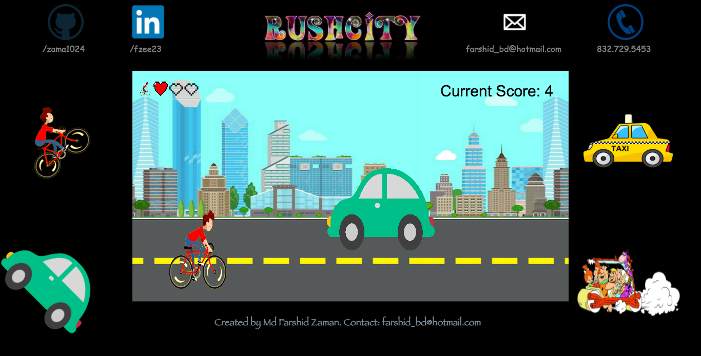

# Rush City


[live](http://www.farshidzaman.tech/RushCity/)

Rush City is a road biking game inspired by Temple Run and Subway Surfers. The goal of the game is to survive as long as possible and get the highest score.

## Instructions
You are a city biker trying to avoid incoming traffic that's coming your way. Press the arrow keys to move around lanes and press the space key to jump.

## Technologies
- Javascript
- HTML5 Canvas

## Features and Implementation
All features in this game were implemented using native JavaScript DOM manipulation and, HTML5 canvas. No additional libraries were used.

### Parallax Background
The Parallax background effect was created by having multiple canvas layers.  

```JavaScript
  document.addEventListener('DOMContentLoaded', ()=> {
    const backgroundCanvas = document.getElementById('background');
    const foregroundCanvas = document.getElementById('foreground');
    const backgroundCtx = backgroundCanvas.getContext('2d');
    const foregroundCtx = foregroundCanvas.getContext('2d');
    const backgroundImage = new Image();
    window.game = false;
    backgroundImage.src = './assets/images/entrybackground.jpg';
    backgroundImage.onload = function(){
      backgroundCtx.drawImage(backgroundImage, 0, 0,850,475);
    };
    window.addEventListener('keydown', function (e) {
      if(e.keyCode === 13 && !window.game){
        window.game = new Game(backgroundCtx, foregroundCtx);
      }
    },false);
  });
```

The background canvas takes care of the background city and road effect, and the foreground is where all the game logic(biker and obstacle movements) happens.

### X,Y and Z axis movements on a 2D canvas
The biker can move around two lanes and also jump when needed. This optical illusion was created by setting a gravity variable and giving the biker a position and speed.


